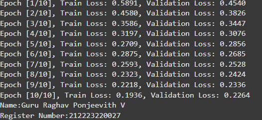
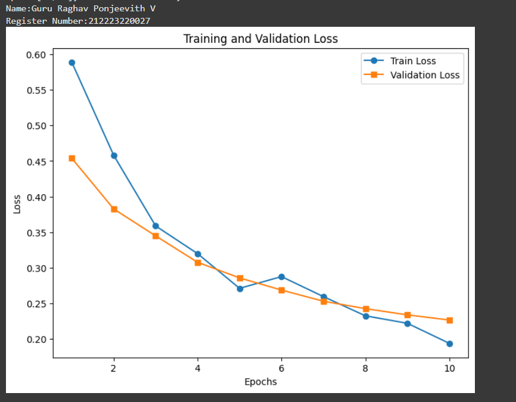
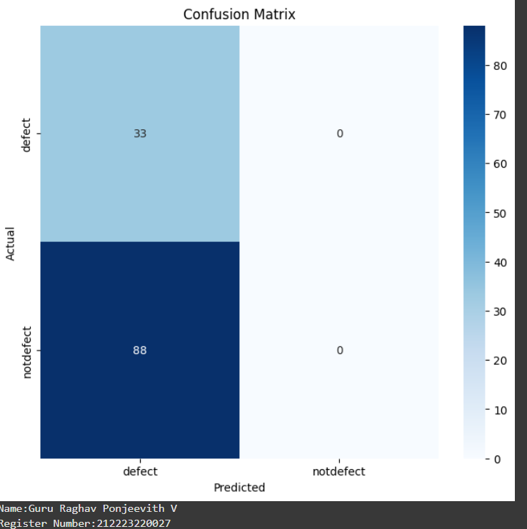
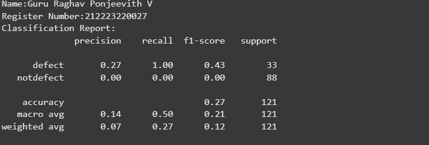
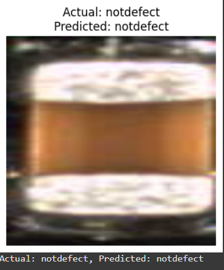
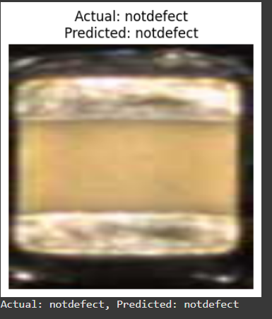

# Implementation-of-Transfer-Learning
## Aim
To Implement Transfer Learning for classification using VGG-19 architecture.
## Problem Statement and Dataset
Include the problem statement and Dataset
</br>
</br>
</br>

## DESIGN STEPS
### STEP 1:
 Import required libraries, load the dataset, and define training & testing datasets.
</br>


### STEP 2:
</br>
Initialize the model, loss function, and optimizer. Use CrossEntropyLoss for multi-class classification and Adam optimizer for efficient training.

### STEP 3:
Train the model using the training dataset with forward and backward propagation.
</br>

### STEP 4:
Evaluate the model on the testing dataset to measure accuracy and performance.
<br/>

### STEP 5:
 Make predictions on new data using the trained model.
 <br/>

## PROGRAM
Include your code here
```python
# Load Pretrained Model and Modify for Transfer Learning

from torchvision.models import VGG19_Weights
model = models.vgg19(weights=VGG19_Weights.DEFAULT)

```


# Modify the final fully connected layer to match the dataset classes
```python
num_classes = len(train_dataset.classes)
in_features = model.classifier[-1].in_features
model.classifier[-1] = nn.Linear(in_features,1)
```
# Include the Loss function and optimizer
```python
criterion = nn.BCEWithLogitsLoss()
optimizer = optim.Adam(model.classifier[-1].parameters(), lr=0.001)
```


# Train the model
```python
def train_model(model, train_loader,test_loader,num_epochs=10):
    train_losses = []
    val_losses = []
    model.train()
    for epoch in range(num_epochs):
        running_loss = 0.0
        for images, labels in train_loader:
            images, labels = images.to(device), labels.to(device)
            optimizer.zero_grad()
            outputs = model(images)
            loss = criterion(outputs, labels.unsqueeze(1).float())
            loss.backward()
            optimizer.step()
            running_loss += loss.item()
        train_losses.append(running_loss / len(train_loader))

        # Compute validation loss
        model.eval()
        val_loss = 0.0
        with torch.no_grad():
            for images, labels in test_loader:
                images, labels = images.to(device), labels.to(device)
                outputs = model(images)
                loss = criterion(outputs, labels.unsqueeze(1).float() )
                val_loss += loss.item()

        val_losses.append(val_loss / len(test_loader))
        model.train()

        print(f'Epoch [{epoch+1}/{num_epochs}], Train Loss: {train_losses[-1]:.4f}, Validation Loss: {val_losses[-1]:.4f}')

    # Plot training and validation loss
    print("Name:Guru Raghav Ponjeevith V")
    print("Register Number:212223220027")
    plt.figure(figsize=(8, 6))
    plt.plot(range(1, num_epochs + 1), train_losses, label='Train Loss', marker='o')
    plt.plot(range(1, num_epochs + 1), val_losses, label='Validation Loss', marker='s')
    plt.xlabel('Epochs')
    plt.ylabel('Loss')
    plt.title('Training and Validation Loss')
    plt.legend()
    plt.show()

```


```

## OUTPUT
### Training Loss
</br>
</br>
</br>


###  Validation Loss Vs Iteration Plot



### Confusion Matrix



</br>
</br>
</br>

### Classification Report


</br>
</br>
</br>

### New Sample Prediction
```
predict_image(model, image_index=65, dataset=test_dataset)
```



```

predict_image(model, image_index=95, dataset=test_dataset)
```

</br>
</br>
</br>

## RESULT
Thus, the Transfer Learning for classification using the VGG-19 architecture has been successfully implemented.
</br>
</br>
</br>
